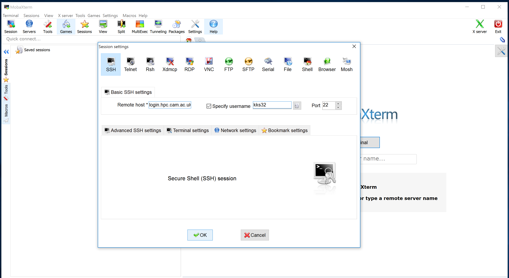
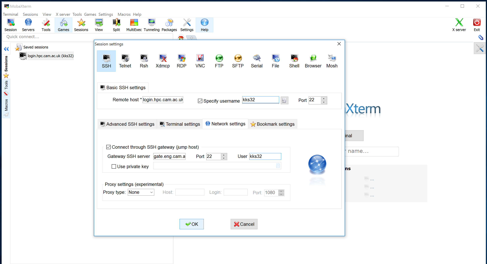

## Off-site access to HPCS

The HPCS is accessible only within Cambridge University Data Network. In order to access HPCS you need to first connect to a CUDN machine, for example the MCS cluster (`linux.pwf.cam.ac.uk`) or the CUED Gateway (`gate.eng.cam.ac.uk`). Port forwarding via SSH (SSH tunneling) creates a secure connection between a local computer and a remote machine through which services can be relayed. In this section we will use `gate.eng.cam.ac.uk` to relay services. Alternatively, `linux.pwf.cam.ac.uk` can also be used.

### Windows (MobaXterm)

* Create an `SSH` session, select `Session` and choose `SSH` in the `Session settings`. 

* Set remote host as `login.hpc.cam.ac.uk`, tick `Specify username` and type your CRSid in the box provided. Leave the port to be `22` and click `OK`.

* Select `Network Settings` tab. Toggle on `Connect through SSH gateway (jump host)`. 

* Set `Gateway SSH server` to `gate.eng.cam.ac.uk`, port as `22` and User `ab123` (CRSid). Select OK.

* Launch the session from Session tab. This will prompt you for `gate.eng.cam.ac.uk` password. 

* This will be followed by another prompt `ab123@127.0.0.1`, this is HPCS forwarded to `gate.eng.cam.ac.uk`. Please enter your RAVEN password to login to HPCS.

### Linux or MacOS

One method to login to HPCS is to first login to an intermediary server (`gate.eng.cam.ac.uk` or `linux.pwf.cam.ac.uk`) and then ssh to HPCS. See previous section on SSH Linux. Alternatively, you can run
do this using a single command:

* Launch a terminal and type `ssh -tt kks32@gate.eng.cam.ac.uk ssh -tt kks32@login.hpc.cam.ac.uk`.

* This will prompt password for `gate.eng.cam.ac.uk` followed by the password prompt for HPCS.
