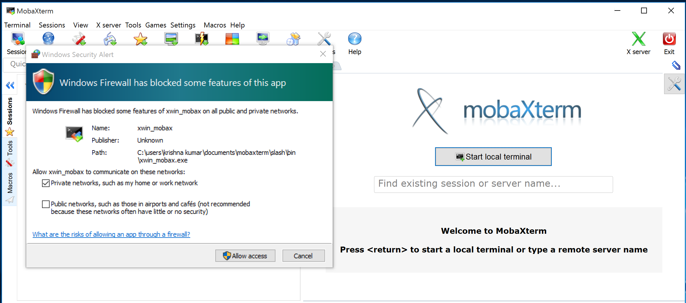
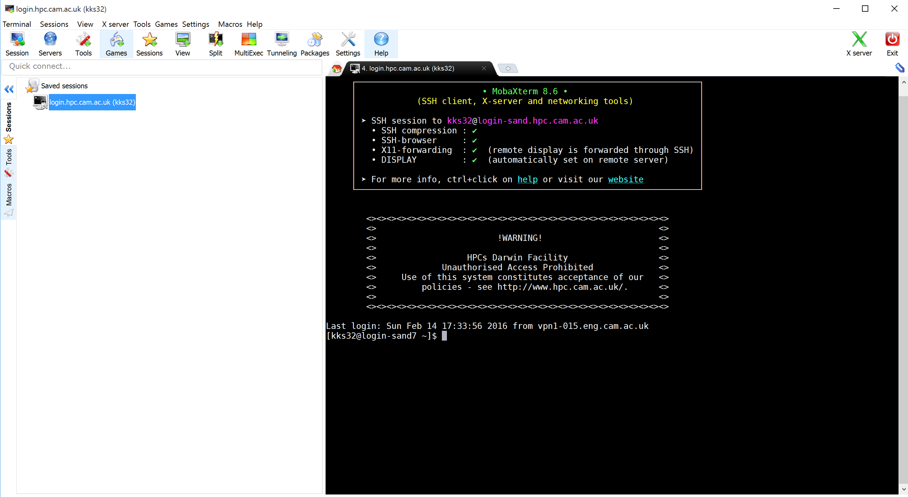

## Windows (MobaXterm)

MobaXterm is a freeware that offers enhanced terminal for Windows with X11 server, SSH clients and other network tools. The personal home edition of MobaXterm can be downloaded from [http://mobaxterm.mobatek.net/download-home-edition.html](http://mobaxterm.mobatek.net/download-home-edition.html). The free personal edition supports 12 sessions, which is sufficient for our use.

* Install and launch MobaXterm. When prompted allow `xwin_mobax` only through private networks, and untick access via Public networks. Do not access these services from open networks.

* To create an `SSH` session, select `Session` and choose `SSH` in the `Session settings`. 

* Set remote host as `login.hpc.cam.ac.uk`, tick `Specify username` and type your CRSid in the box provided. Leave the port to be `22` and click `OK`.

* You should now be able to see `login.hpc.cam.ac.uk(crsid)` in the Sessions tab. Select this session. This should prompt you for your password. This is your RAVEN password.

* Provided you have entered all the details correctly, you should now be logged into one of the login nodes. The choice of login nodes assigned to you depends on the number of users connected to a particular node at that instance.

* Individual login nodes `login-sand1.hpc.cam.ac.uk` to `login-sand8.hpc.cam.ac.uk` may be explicitly accessed in the same way (the generic names `login.hpc.cam.ac.uk` and `login-sand.hpc.cam.ac.uk` select a random node from this set).

