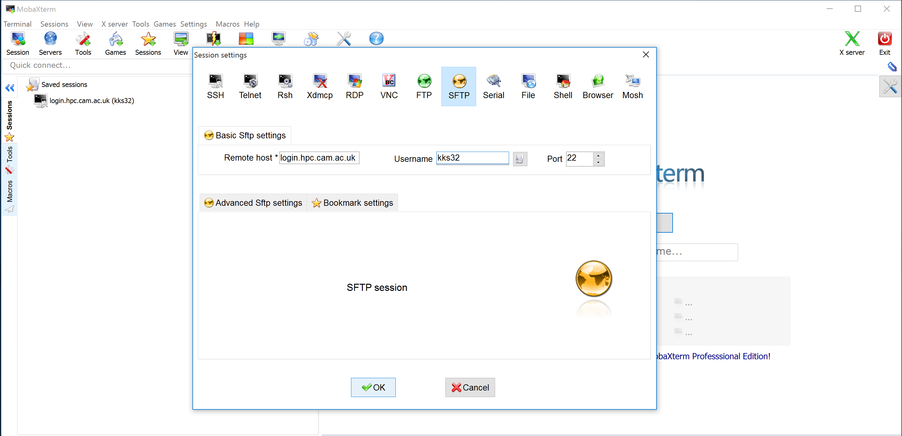
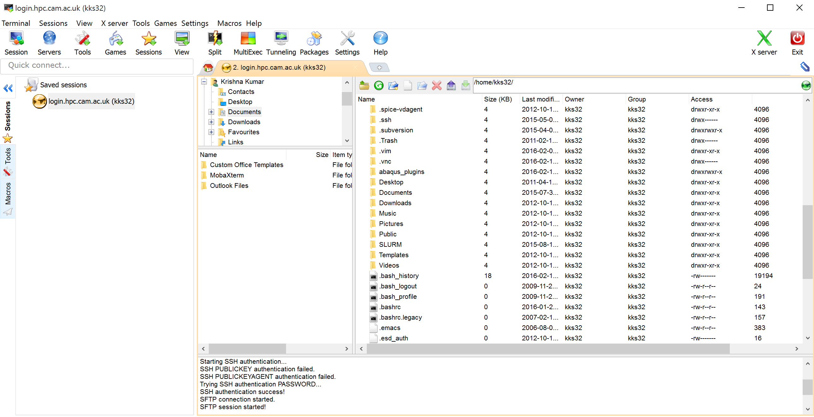

# File transfers

Any method of file transfer that operates over SSH (e.g. scp, sftp, rsync) should work to or from HPCS, provided SSH access works in the same direction.

## Windows (MobaXterm)

The personal home edition of MobaXterm can be downloaded from [http://mobaxterm.mobatek.net/download-home-edition.html](http://mobaxterm.mobatek.net/download-home-edition.html). We will be using Secure File 
Transfer Protocol (SFTP) to transfer files. 

* Launch MobaXterm

* To create an `SFTP` session on MobaXterm, select `Session` and choose `SFTP` in the `Session settings`. 

* Set remote host as `login.hpc.cam.ac.uk`, username as your CRSid in the box provided. Leave the port to be `22` and click `OK`.

* The SFTP session window allows you to upload / download files.

## Linux or Mac (rsync)

rsync is possibly the fastest, the most sophisticated and also the most dangerous. A pleasant feature of rsync is that repeating the same command will lead to only files which appear to have been updated (based on the size and modification timestamp) being transferred. Rsync also validates each actual transfer by comparing checksums.

### Copy files from HPCS to local system

Consider we are copying files in the `results` folder in the HPCS scratch directory of the user to a local directory `from_darwin`:

`rsync -avcz --progress ab123@login.hpc.cam.ac.uk:/scratch/ab123/results/ from_darwin`

Note that a final `/` on the source directory is significant for rsync - it would indicate that only the contents of the directory would be transferred (so specifying `results/` in the above example would result in the contents being copied straight to `from_darwin` instead of `from_darwin/results`).

The rsync options:
* `-a` - Archive mode. Preserves everything, including symlinks.

* `-v` - Verbose

* `-c` - Checksum. This checks the integrity of file at the end of transfer.

* `-z` - Compress files before transferring, to improve file transfers on slow connections.

* `--progress` - Shows the progress of transfer.

* `-R` - Recursively copy folders.

### Copy files from local system to HPCS

Consider we are copying files in the `local_input` folder to the HPCS scratch directory of the user `analysis`:

`rsync -avcz --progress ~/.local_input/ ab123@login.hpc.cam.ac.uk:/scratch/ab123/analysis/`

