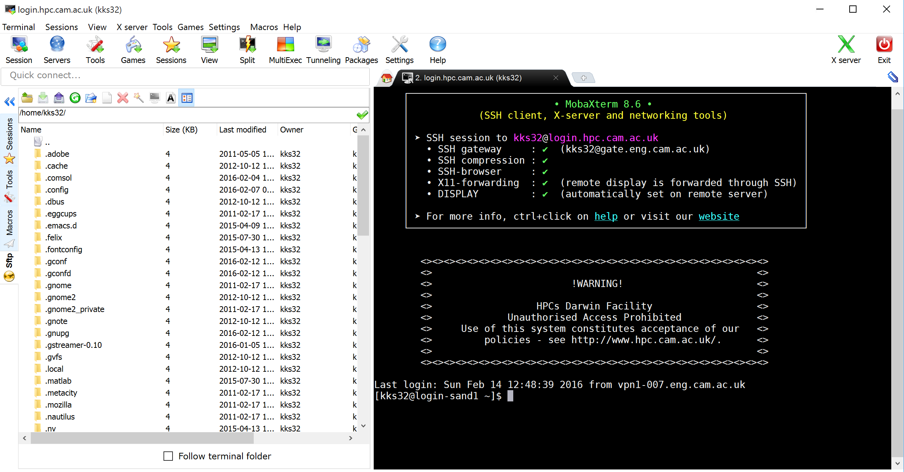

## Windows (MobaXterm)

The personal home edition of MobaXterm can be downloaded from [http://mobaxterm.mobatek.net/download-home-edition.html](http://mobaxterm.mobatek.net/download-home-edition.html). We will be using Secure File 
Transfer Protocol (SFTP) to transfer files. 

* Launch MobaXterm

* To create an `SFTP` session on MobaXterm, select `Session` and choose `SFTP` in the `Session settings`. 

* Set remote host as `login.hpc.cam.ac.uk`, username as your CRSid in the box provided. Leave the port to be `22` and click `OK`.

* The SFTP session window allows you to upload / download files.

### Off-site access (Windows via MobaXterm)

* Follow the steps listed in [off-site HPCS access using MobaXterm](../access/offsite.md)

* This will launch an `SSH` and a `SFTP` session as shown below.

