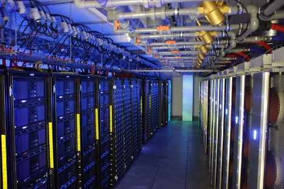

# The HPCS Service

The HPCS service consists of two clusters, the large CPU compute cluster (Darwin) and the GPU compute cluster (Wilkes).

Further details on Darwin can be found [here](http://www.hpc.cam.ac.uk/services/darwin)

Further details on Wilkes can be found [here](http://www.hpc.cam.ac.uk/services/wilkes)

In order to be run as a self-sustaining cost centre and maximise the useful scientific output of the HPC service there are clear usage policies and well-defined guaranteed service level agreements.

Further discussion can be found [here](http://www.hpc.cam.ac.uk/policies/background)

The Wilkes Cluster ([Image reference](http://www.hpc.cam.ac.uk/services/wilkes))